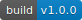

# study-platform

> Node.js(v8.9.3) + Nuxt.js + Vue(2.5.16) + mint-ui + mockjs

## Build Setup 

``` bash
# install dependencies
$ npm install # Or yarn install

# serve with hot reload at localhost:6008
$ npm run dev

# serve mock with hot reload at localhost:6008
$ npm run mock

# test server generate static files & copy static file to server
$ npm run generate-sit

# production server generate static files & copy static file to server
$ npm run generate-prod

.
├── api                   // 请求数据接口封装
├── assets                // 静态资源
├── components            // 组件
├── config                // 各个环境的配置文件
├── dist                  // server最终打包上线目录
├── layouts               // 布局
├── middleware            // 中间件
├── pages                 // 页面
│   ├── activity          // 活动相关
│   ├── community         // 圈子管理
│   ├── groups            // 圈子
│   ├── note              // 笔记
│   ├── personal          // 个人相关
│   ├── search            // 搜索
│   ├── ucenter           // 个人中心
│   ├── index.vue         // 首页入口
├── plugins               // 插件
│   ├── mock              // 拦截请求mock数据，根据模块划分不同文件夹
│   ├── mock.js           // 拦截请求mock数据入口文件，只有npm run mock模式下加载
│   ├── axios.js          // ajax请求封装
│   ├── mint-ui.js        // mint-ui
│   ├── swiper.js         // swiper组件
│   ├── vue-cookie.js     // vue-cookie组件
├── static                // 静态资源
│   ├── css               // 静态JS
│   └── js                // 静态CSS
├── utils`                // utils方法
│   ├── config.js         // 业务配置文件(和环境无关)
│   ├── eventbus.js       // 全局event hook
│   ├── formatter.js      // 格式化相关处理方法
│   ├── index.js          // 快速方法方法入口
│   ├── pagination.js     // 分页相关方法
│   ├── storge.js         // localstorge封装
│   ├── utils.js          // utils封装类
└───nuxt.config.js        // nuxt.js配置文件


For detailed explanation on how things work, checkout the [Nuxt.js docs](https://github.com/nuxt/nuxt.js).
